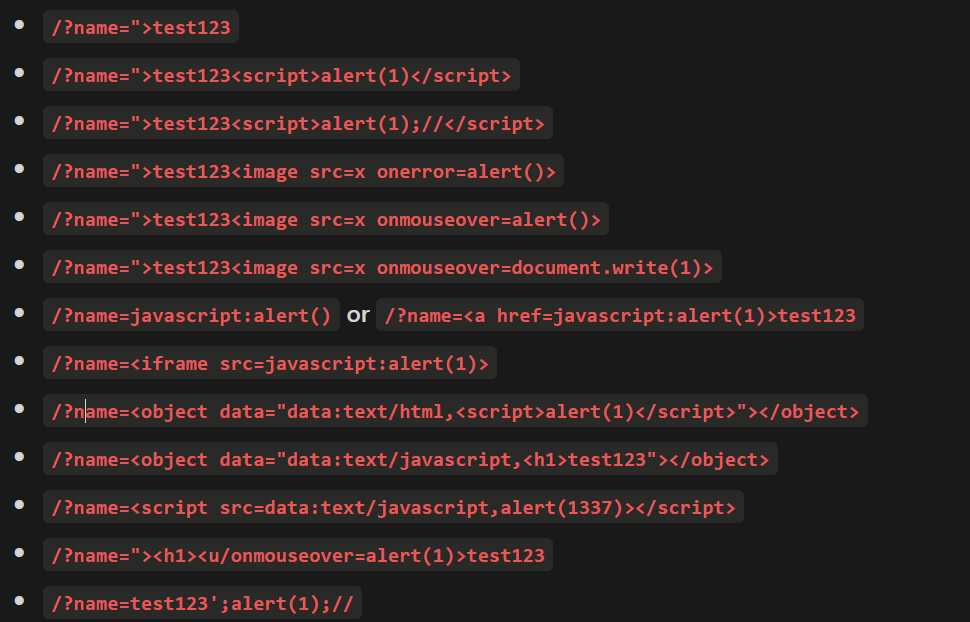

## DOM XSS in AngularJS expression

- __When HTML contains ng-app attribute__
  - __you can execute arbitrary JavaScript code__
  - __To get the payloads go to book.hacktricks.xyz__
  - __use any payload in the search bar__
